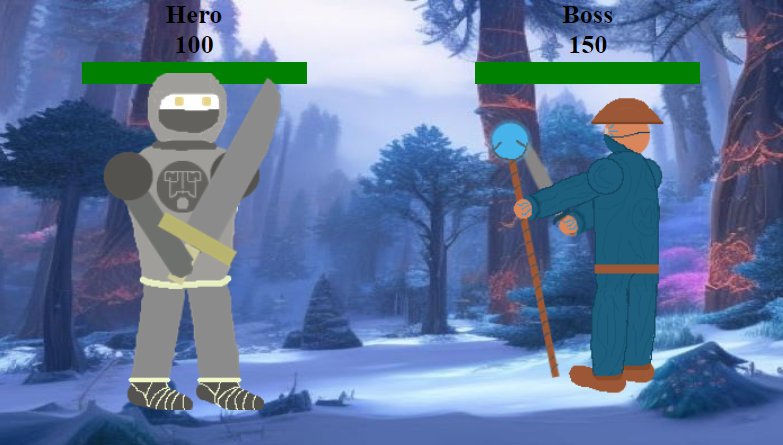

# Holy-Quest
Turn based game

# Goal for this Project
My goal is to creat a simple game that works as intended without any bugs or unwanted occurrences

## User Goals
* Everything works as I want it too
* Looks okey enough
* Runs good and wont cause any errors
## Site owner goal
* Quick little game for you to enjoy
* Not buggy
### Requirments
* Everything is understandeble 
* Game is playble
### Expectations
* Quick and basic game that runs smoothly

## Design Choice

### Colors
*rgb(230, 150, 31) Used for the Header text and Icons as well as background for the attack options
*rgb(58, 85, 108) Background for the intro screens as well as the place containing the attack options
*rgb(88, 50, 50) Background for Header  

# Features

## Existing Features

### Start game Screen
* Start screen with a snowy forest in the background and a button that starts it

### Three "Intro" Screens
* First thing that is showed after you pressed the start button with abit of story and goes away after a couple of seconds and the game starts

* Second one pops up after the first enemy is defeated and tells you that the hero seems to thrive of killing these things

* Third one is after you kill the second enemy which says that you see the commander and once again feel eager to kill

### Three game Screens with individual enemys
* First battle against a very simple Undead which deals 20 dmg each turn

* Second battle is against a mimic which will cast any ability you do so to guarante victory you need to throw the Attack until you roll 31 dmg or more and then finish him off with spells and since he copys anything you do that means if you roll under 31 you can simpely heal and he will do the same

* Third battle is against the boss who has 150 hp and deals 25 dmg per turn so you can still out heal the dmg but it will take a while

### Two "End game" Screens
* Right after you beat the boss you get the first end screen

* Then after ten seconds you get the second end screen with the plot twist and the option to start over

### Lose game Screen
* If at any point you die you will be shown this lose screen with the option to restart

### 3 diffrent attack options
* You have 3 diffrent options each turn which are Attacking for a random damge between 25 and 35, Spell which deals a consistant 30 dmg and finally a heal to get your own hp back up

# Testing
 Have played it multiple times and made sure everything works as intended

## Validator Test

### Html
* No problems when going through The Officlal W3C Validator
### Css
* No problems when going through The Officlal (Jigsaw) Validator

## Unfixed Bugs
 There are no unfixed bugs

# Deployment 
Deployed on GitHub pages by going into the repository settings and finding the page tab and selecting the master branch

# Credits
## Content 
* Icons in the header are from Font Awesome